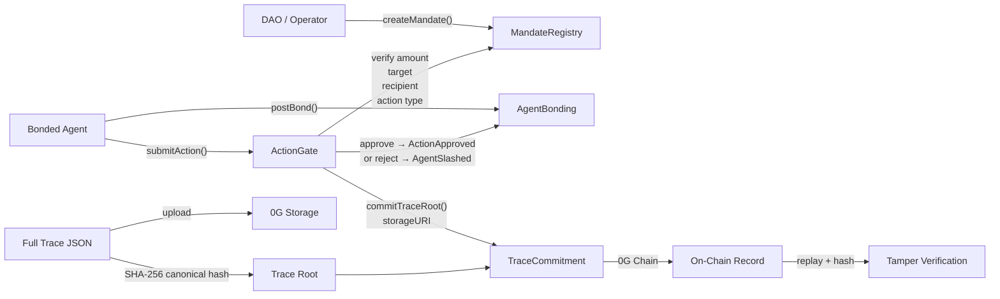
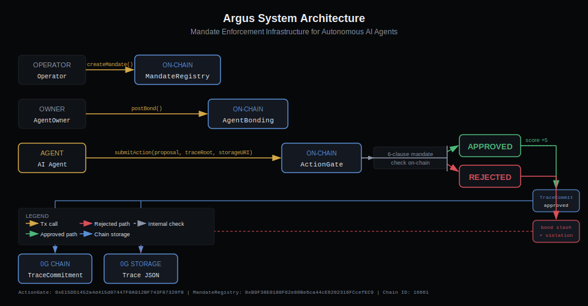
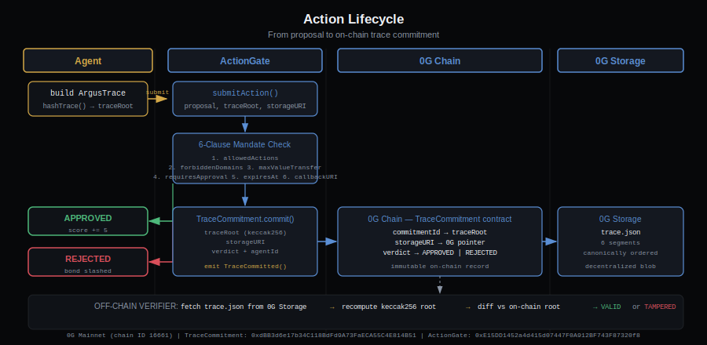
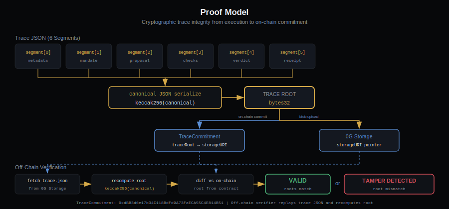
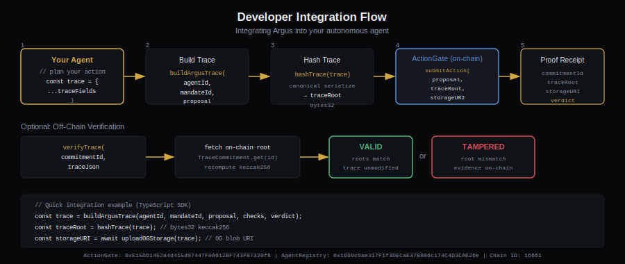

# Argus

[](https://chainscan.0g.ai/address/0xE15DD1452a4d415d07447F0A912BF743F87320f8) [](https://github.com/Vinaystwt/argus) [](LICENSE) [](https://useargus.xyz)

**Agent accountability infrastructure: a cryptographic black box, mandate enforcement court, replayable proof system, and slashable trust layer for autonomous AI agents with financial authority.**

---

## The Problem

Autonomous AI agents are being given financial authority over DeFi treasuries, investment portfolios, and on-chain funds. There is currently no standard way for an operator, auditor, or regulator to answer: *did this agent actually follow its mandate, and if not, was it punished?*

Without accountability infrastructure, delegated agent authority is unverifiable trust.

---

## How It Works

Every agent action must pass through a cryptographic proof path before it can touch funds:



The core proof path: **mandate → bonded agent → ActionGate → verdict → trace root → 0G Storage → 0G Chain → slash → replay → tamper verification**

---

## Architecture



| Layer | Description |
|---|---|
| Contracts | 5 core contracts: `MandateRegistry`, `AgentRegistry`, `AgentBonding`, `TraceCommitment`, `ActionGate` |
| Trace schema | `ArgusTrace` v1 — 6 deterministic segments, canonical keccak256 root |
| Storage | `packages/storage-0g` — uploads full trace JSON to 0G Storage |
| Agent runner | `packages/agent-runner` — compliant and violation scenario runner |
| Frontend | `apps/web` — proof replay, tamper detection, mandate registry, agent dashboard |

### Action Lifecycle



### Proof Model



### Developer Integration



See [`docs/architecture.md`](docs/architecture.md) for full written documentation.

---

## Quickstart

Five steps to verify a live proof in your browser:

1. **Open the chain explorer** — visit [chainscan.0g.ai](https://chainscan.0g.ai) and search for ActionGate: [`0xE15DD1452a4d415d07447F0A912BF743F87320f8`](https://chainscan.0g.ai/address/0xE15DD1452a4d415d07447F0A912BF743F87320f8)

2. **Open the compliant action tx** — [`0xaa205f...`](https://chainscan.0g.ai/tx/0xaa205f208bcf63040571ec474acfb40d05536d340031ebf0d2cfb9e609041a58) — confirm events: `ActionApproved`, `TraceCommitted`, `ComplianceScoreUpdated`

3. **Open the slashing tx** — [`0x203058...`](https://chainscan.0g.ai/tx/0x2030587c4280385e3d366eac77a292620b5eac2ac56116325f37436ce972408a) — confirm events: `ActionRejected`, `AgentSlashed`, `TraceCommitted`, `ComplianceScoreUpdated`

4. **Open the storage explorer** — visit [storagescan.0g.ai](https://storagescan.0g.ai) and confirm the [compliant trace upload](https://storagescan.0g.ai/tx/0x4d9cb8d1506dc1bde43c7876d8e8b9058f108f2b4e82ec8932970648ad6c9331) and [violation trace upload](https://storagescan.0g.ai/tx/0xec898043d3b8985a992e49d9ffff9fc0e3109cbb88243e41e654be941fc75341)

5. **Open the product console** — [useargus.xyz](https://useargus.xyz) — navigate to the Verify Workbench and replay either trace; mutate a field and confirm `TAMPER DETECTED`

---

## Live on 0G Mainnet

**Network:** 0G Mainnet · Chain ID: `16661` · Explorer: [chainscan.0g.ai](https://chainscan.0g.ai)

### Contract Addresses

All core contracts are source-verified on [chainscan.0g.ai](https://chainscan.0g.ai).

| Contract | Address | Verified |
|---|---|---|
| MandateRegistry | [`0xB9F38E0180F62e80Be6ca44cE6202316FCcefEC9`](https://chainscan.0g.ai/address/0xB9F38E0180F62e80Be6ca44cE6202316FCcefEC9) | ✅ |
| AgentRegistry | [`0x1699c6ae317F1f3DECaE37B806c174C4D3CAE26e`](https://chainscan.0g.ai/address/0x1699c6ae317F1f3DECaE37B806c174C4D3CAE26e) | ✅ |
| AgentBonding | [`0x8aE5480D7fFAADb5f8Ef99246562a61Da30cf7E7`](https://chainscan.0g.ai/address/0x8aE5480D7fFAADb5f8Ef99246562a61Da30cf7E7) | ✅ |
| TraceCommitment | [`0xdBB3d6e17b34C118BdFd9A73FaECA55C4E814B51`](https://chainscan.0g.ai/address/0xdBB3d6e17b34C118BdFd9A73FaECA55C4E814B51) | ✅ |
| ActionGate | [`0xE15DD1452a4d415d07447F0A912BF743F87320f8`](https://chainscan.0g.ai/address/0xE15DD1452a4d415d07447F0A912BF743F87320f8) | ✅ |
| MockERC20 | [`0x1850d2a31CB8669Ba757159B638DE19Af532ba5e`](https://chainscan.0g.ai/address/0x1850d2a31CB8669Ba757159B638DE19Af532ba5e) |
| MockUniswap | [`0x9db2e380f9100793ea71413224dD7C22F97aD91B`](https://chainscan.0g.ai/address/0x9db2e380f9100793ea71413224dD7C22F97aD91B) |
| MockMorpho | [`0x536b31435bFAE994169181AcA9BAadC784555b4B`](https://chainscan.0g.ai/address/0x536b31435bFAE994169181AcA9BAadC784555b4B) |
| MockTreasury | [`0x6C6e9bC9cBd3f0A90D61E094b4997199B81A02d5`](https://chainscan.0g.ai/address/0x6C6e9bC9cBd3f0A90D61E094b4997199B81A02d5) |

### Live Demo Transactions

| Step | Tx | Events |
|---|---|---|
| Create mandate | [`0x0f9265...`](https://chainscan.0g.ai/tx/0x0f926575b63b1f5900ba5145a895cef2ea964f65ff9982d5504c0d7cedfc304a) | `MandateCreated` |
| Register agent | [`0x05ee08...`](https://chainscan.0g.ai/tx/0x05ee08d463fd756d87809ec1b22aa1d7cbd41fc90ad45c279d9c63a3abcf5a96) | `AgentRegistered` |
| Post bond | [`0x6d4e90...`](https://chainscan.0g.ai/tx/0x6d4e90030a7802674b431d4626eb36c28f2390a12eb7f8991001c29edc4a58d3) | `BondPosted` |
| Compliant action | [`0xaa205f...`](https://chainscan.0g.ai/tx/0xaa205f208bcf63040571ec474acfb40d05536d340031ebf0d2cfb9e609041a58) | `ActionApproved`, `TraceCommitted`, `ComplianceScoreUpdated` |
| Malicious rejection | [`0x203058...`](https://chainscan.0g.ai/tx/0x2030587c4280385e3d366eac77a292620b5eac2ac56116325f37436ce972408a) | `ActionRejected`, `AgentSlashed`, `TraceCommitted`, `ComplianceScoreUpdated` |

### 0G Storage Receipts

| Artifact | 0G URI | Upload |
|---|---|---|
| Compliant trace | `0g://0x0d33a82d37fce005c7380c8cfb067d7a9eac77b63b88ab38bb76dadcd48fb740` | [storagescan.0g.ai](https://storagescan.0g.ai/tx/0x4d9cb8d1506dc1bde43c7876d8e8b9058f108f2b4e82ec8932970648ad6c9331) |
| Violation trace | `0g://0xc3893ee2e0589ea4d73e3a704252cbc0c172e2ed3e28524e3131052a3e895095` | [storagescan.0g.ai](https://storagescan.0g.ai/tx/0xec898043d3b8985a992e49d9ffff9fc0e3109cbb88243e41e654be941fc75341) |

### Trace Roots

| Scenario | Committed Root |
|---|---|
| Compliant approved | `0xb81c626b73f1395c60f75e86c1df2021b64e3b0aba85ff9b8b84db438da42c3b` |
| Malicious rejected | `0x39d2ef7a4248a73be210514d8600a238c2aea8b5dda8ad29544a79d162593cf6` |

Both roots are committed on-chain via `TraceCommitment.commitTraceRoot()` and are independently recomputable from the full trace JSON stored on 0G Storage.

---

## Frontend

The product console is live at [https://useargus.xyz](https://useargus.xyz).

| Surface | URL |
|---|---|
| Console dashboard | [useargus.xyz](https://useargus.xyz) |
| Demo flow | [useargus.xyz/demo](https://useargus.xyz/demo) |
| Trace explorer | [useargus.xyz/traces](https://useargus.xyz/traces) |
| Agent passport | [useargus.xyz/agents](https://useargus.xyz/agents) |
| Mandate registry | [useargus.xyz/mandates](https://useargus.xyz/mandates) |
| Violation inbox | [useargus.xyz/violations](https://useargus.xyz/violations) |
| Verify workbench | [useargus.xyz/verify](https://useargus.xyz/verify) |
| Developer portal | [useargus.xyz/developers](https://useargus.xyz/developers) |
| Roadmap | [useargus.xyz/roadmap](https://useargus.xyz/roadmap) |

---

## Packages

| Package | Description | Status |
|---|---|---|
| `@useargus/sdk` | Proof verification SDK + CLI | Built; npm publish pending |
| `@useargus/mcp` | MCP server for AI agent tooling | Built; npm publish pending |
| `@argus/shared` | Canonical types, schemas, keccak256 hashing | Internal monorepo |
| `@argus/storage-0g` | 0G Storage upload client | Internal monorepo |
| `@argus/agent-runner` | Scenario runner for compliant/violation flows | Internal monorepo |

### SDK

```typescript
import { verifyTrace, ARGUS_CONTRACTS } from "@useargus/sdk";

const result = verifyTrace(traceJson, committedRoot);
console.log(result.status); // "valid" | "mismatch"

const contracts = ARGUS_CONTRACTS["0g-mainnet"].contracts;
// ActionGate: 0xE15DD1452a4d415d07447F0A912BF743F87320f8
```

### CLI

```bash
# Build from source:
pnpm --filter @argus/shared build && pnpm --filter @useargus/sdk build

node packages/sdk/dist/cli/index.js contracts
node packages/sdk/dist/cli/index.js verify trace.json --root 0xb81c626b...
node packages/sdk/dist/cli/index.js inspect proof.json
node packages/sdk/dist/cli/index.js explain proof.json
```

### MCP Server

```bash
pnpm --filter @useargus/mcp build
node packages/mcp-server/dist/index.js
```

MCP config:

```json
{
  "argus": {
    "command": "node",
    "args": ["/path/to/argus/packages/mcp-server/dist/index.js"]
  }
}
```

Tools: `hash_trace`, `verify_trace`, `inspect_proof_package`, `explain_violation`, `get_argus_contracts`, `get_demo_transactions`, `get_storage_receipts`.

To publish `@useargus/sdk` and `@useargus/mcp` to npm after `npm login`:

```bash
cd packages/sdk && npm publish --access public
cd packages/mcp-server && npm publish --access public
```

---

## Local Setup

```bash
# Install dependencies
pnpm install

# Run the demo (generates demo-data.json from live deployment data)
pnpm demo:local

# Validate all proof data consistency
pnpm validate:data

# Start the frontend
pnpm --filter @argus/web dev
```

Open [http://localhost:3000](http://localhost:3000).

**Deploy contracts locally (Anvil):**

```bash
anvil
pnpm contracts:deploy:local
```

**Deploy to 0G Mainnet:**

```bash
export OG_RPC_URL="https://evmrpc.0g.ai"
export PRIVATE_KEY="0x..."
pnpm contracts:deploy:0g
```

---

## Running Tests

**Foundry (contract tests):**

```bash
forge test -vvv
```

27/27 tests pass. Key test: `contracts/test/ArgusDemoFlow.t.sol` — covers the full mandate → bond → approve → reject → slash proof path.

**Playwright (frontend tests):**

```bash
pnpm --filter @argus/web test:e2e
```

12/12 tests pass.

---

## Real vs Roadmap

| Feature | Status |
|---|---|
| Solidity contracts (mandate, bond, gate, trace, slash) | ✅ Live on 0G Mainnet |
| On-chain mandate creation | ✅ Live — [tx](https://chainscan.0g.ai/tx/0x0f926575b63b1f5900ba5145a895cef2ea964f65ff9982d5504c0d7cedfc304a) |
| On-chain agent registration + bond | ✅ Live — [tx](https://chainscan.0g.ai/tx/0x6d4e90030a7802674b431d4626eb36c28f2390a12eb7f8991001c29edc4a58d3) |
| ActionGate compliant approval | ✅ Live — [tx](https://chainscan.0g.ai/tx/0xaa205f208bcf63040571ec474acfb40d05536d340031ebf0d2cfb9e609041a58) |
| ActionGate malicious rejection + slash | ✅ Live — [tx](https://chainscan.0g.ai/tx/0x2030587c4280385e3d366eac77a292620b5eac2ac56116325f37436ce972408a) |
| On-chain trace root commitments | ✅ Live |
| 0G Storage trace uploads | ✅ Live — [compliant](https://storagescan.0g.ai/tx/0x4d9cb8d1506dc1bde43c7876d8e8b9058f108f2b4e82ec8932970648ad6c9331) / [violation](https://storagescan.0g.ai/tx/0xec898043d3b8985a992e49d9ffff9fc0e3109cbb88243e41e654be941fc75341) |
| Canonical trace hashing + tamper verification | ✅ Live |
| 27/27 Foundry tests | ✅ Passing |
| 12/12 Playwright tests | ✅ Passing |
| Product console (useargus.xyz) | ✅ Deployed |
| 0G Compute / TEE policy attestation | 🗺️ Roadmap |
| Agent ID / iNFT portable identity | 🗺️ Roadmap |
| Production DeFi integrations (real Uniswap/Morpho) | 🗺️ Roadmap |
| Production dispute resolution | 🗺️ Roadmap |
| npm SDK publication | 🗺️ In development |
| CLI tool publication | 🗺️ In development |
| MCP server publication | 🗺️ In development |
| Readback-verified 0G Storage | 🗺️ Roadmap |

---

## Security Model

- **Mandate enforcement is on-chain.** `ActionGate` is the only path to fund movement; it verifies amount, target, recipient, and action type against the stored mandate before any approval.
- **Bond creates real economic skin in the game.** The agent's bond is slashed immediately upon rejection — no delay, no governance vote.
- **Trace roots are tamper-evident.** The root is SHA-256 over canonical JSON with the mutable `proof` block excluded. Any mutation to the trace changes the root, which will not match the committed on-chain value.
- **0G Storage provides external verifiability.** Full trace payloads are stored outside the chain and retrievable for independent replay and audit.
- **Mock DeFi targets are intentional.** The demo uses `MockUniswap` and `MockMorpho` for reliable demo execution. These are real deployed contracts; the DeFi logic is simplified by design.

---

## Roadmap

1. 0G Compute / TEE sealed policy checks with verifiable verdicts.
2. Agent ID / iNFT — persistent, portable compliance history across mandates and operators.
3. Production DeFi integrations (Uniswap v3, Morpho Blue, Aave).
4. Production dispute resolution court with watcher incentives.
5. npm SDK, CLI, and MCP server publication.
6. 0G Storage readback verification.

---

## License

MIT — see [`LICENSE`](LICENSE)
