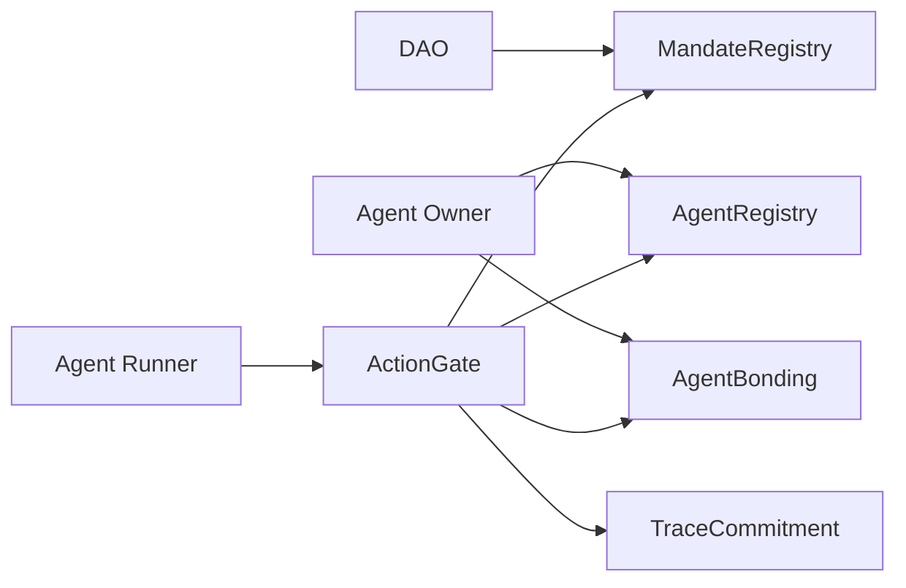
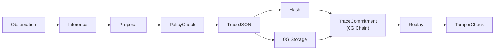

# Argus Architecture

Argus is deployed to 0G Mainnet (Chain ID 16661). All contracts are live. The architecture is split into five layers:

1. **Contracts** — mandate court and state transitions, live on 0G Mainnet.
2. **Shared schemas** — canonical action, verdict, and trace data; SHA-256 trace root hashing.
3. **Storage adapter** — `packages/storage-0g` uploads full trace JSON to 0G Storage.
4. **Agent runner** — `packages/agent-runner` — deterministic compliant and compromised scenarios.
5. **Frontend** — `apps/web` — proof replay, tamper detection, mandate registry, agent passport, violation inbox.

## Contract Flow

`ActionGate.submitAction` is the only route to approval/rejection. It checks amount, target, recipient, action type, and asset against the mandate. Rejected actions commit a trace and slash bond atomically.

**Live contract addresses (0G Mainnet):**

| Contract | Address |
|---|---|
| MandateRegistry | [`0xB9F38E0180F62e80Be6ca44cE6202316FCcefEC9`](https://chainscan.0g.ai/address/0xB9F38E0180F62e80Be6ca44cE6202316FCcefEC9) |
| AgentRegistry | [`0x1699c6ae317F1f3DECaE37B806c174C4D3CAE26e`](https://chainscan.0g.ai/address/0x1699c6ae317F1f3DECaE37B806c174C4D3CAE26e) |
| AgentBonding | [`0x8aE5480D7fFAADb5f8Ef99246562a61Da30cf7E7`](https://chainscan.0g.ai/address/0x8aE5480D7fFAADb5f8Ef99246562a61Da30cf7E7) |
| TraceCommitment | [`0xdBB3d6e17b34C118BdFd9A73FaECA55C4E814B51`](https://chainscan.0g.ai/address/0xdBB3d6e17b34C118BdFd9A73FaECA55C4E814B51) |
| ActionGate | [`0xE15DD1452a4d415d07447F0A912BF743F87320f8`](https://chainscan.0g.ai/address/0xE15DD1452a4d415d07447F0A912BF743F87320f8) |

## Trace Flow

The trace root is SHA-256 over canonical JSON with the mutable `proof` block excluded. The root is committed on 0G Chain via `TraceCommitment.commitTraceRoot()`. The full payload is stored on 0G Storage. Any mutation to the payload produces a different root — detectable by recomputing and comparing against the committed value.

**Live trace roots:**

| Scenario | Root | On-chain tx |
|---|---|---|
| Compliant approved | `0xb81c626b73f1395c60f75e86c1df2021b64e3b0aba85ff9b8b84db438da42c3b` | [tx](https://chainscan.0g.ai/tx/0xaa205f208bcf63040571ec474acfb40d05536d340031ebf0d2cfb9e609041a58) |
| Malicious rejected | `0x39d2ef7a4248a73be210514d8600a238c2aea8b5dda8ad29544a79d162593cf6` | [tx](https://chainscan.0g.ai/tx/0x2030587c4280385e3d366eac77a292620b5eac2ac56116325f37436ce972408a) |

## 0G Storage Integration

Full trace payloads are uploaded to 0G Storage via `packages/storage-0g`. The storage root is the content address returned after upload and is committed on-chain alongside the SHA-256 trace root.

| Artifact | 0G URI | Upload |
|---|---|---|
| Compliant trace | `0g://0x0d33a82d37fce005c7380c8cfb067d7a9eac77b63b88ab38bb76dadcd48fb740` | [storagescan.0g.ai](https://storagescan.0g.ai/tx/0x4d9cb8d1506dc1bde43c7876d8e8b9058f108f2b4e82ec8932970648ad6c9331) |
| Violation trace | `0g://0xc3893ee2e0589ea4d73e3a704252cbc0c172e2ed3e28524e3131052a3e895095` | [storagescan.0g.ai](https://storagescan.0g.ai/tx/0xec898043d3b8985a992e49d9ffff9fc0e3109cbb88243e41e654be941fc75341) |

## Roadmap Integration Points

- **0G Compute / TEE** — sealed policy checks with verifiable verdicts, without exposing treasury strategy. The ActionGate verdict interface is designed to receive TEE-signed outcomes.
- **Agent ID / iNFT** — persistent identity carrying compliance history, bond status, and reputation across mandates.
- **Production DeFi** — replace mock Uniswap/Morpho targets with real protocol integrations.
